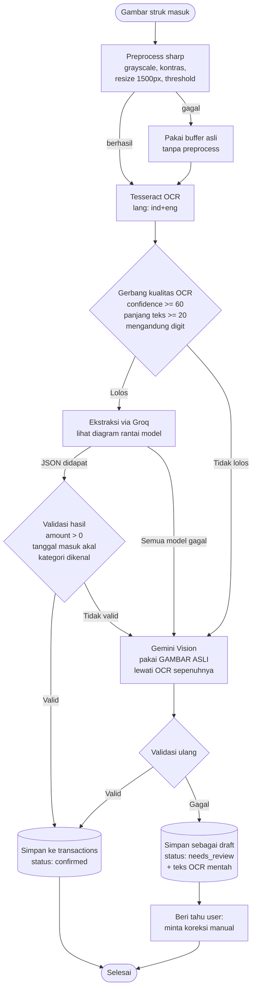
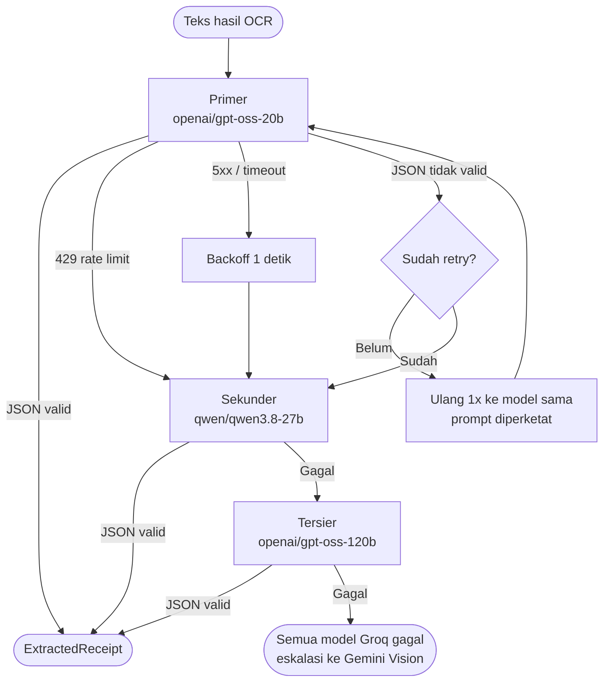
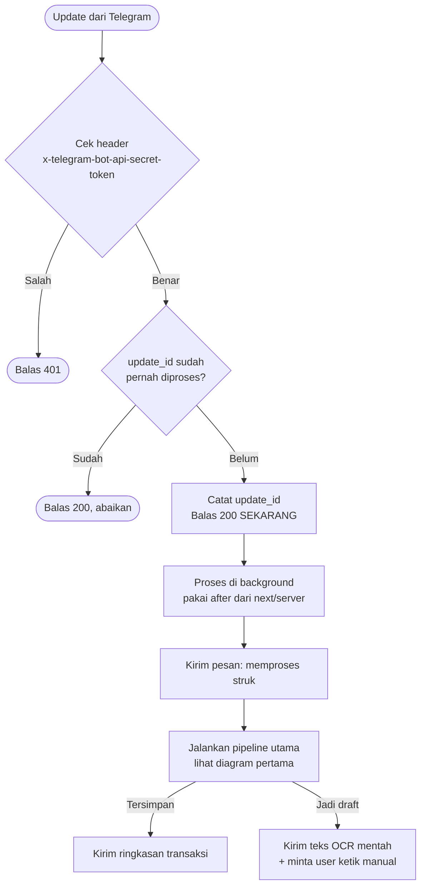

# Strategi Fallback — Pipeline Ekstraksi Struk

Dokumen desain alur pemrosesan struk dari gambar sampai tersimpan di database,
beserta jalur cadangan di tiap titik yang bisa gagal.

Stack: **sharp** (preprocess) → **Tesseract** (OCR) → **Groq** (ekstraksi JSON) →
**Gemini Vision** (jaring pengaman terakhir).

---

## Prinsip

1. **Eskalasi, bukan pengulangan.** Fallback harus pindah ke jalur yang secara
   kualitatif berbeda. Mengulang hal yang sama dengan harapan hasil berbeda cuma
   membakar kuota.
2. **Gagal cepat di gerbang kualitas.** Kalau OCR menghasilkan sampah, jangan
   kirim ke Groq sama sekali — LLM teks tidak bisa menyelamatkan teks yang rusak.
   Langsung lompat ke Vision.
3. **Data user tidak boleh hilang.** Kalau semua jalur gagal, simpan sebagai draft
   berisi teks OCR mentah supaya user bisa koreksi manual. Jangan balas "error"
   lalu buang strukya.
4. **Vision adalah pilihan terakhir.** Paling mahal token dan paling terbatas
   kuotanya. Hanya dipakai kalau OCR atau Groq benar-benar mentok.

---

## Alur utama

Titik penting: anak panah **GATE → VISION** melompati Groq. Ini yang membedakan
desain ini dari fallback naif. Kalau `confidence` OCR rendah, mengirim teks rusak
ke Groq hanya menghasilkan tebakan yang percaya diri tapi salah — lebih buruk
daripada gagal, karena salahnya tidak kelihatan.

---

## Rantai model Groq

Tiap model punya kuota sendiri, jadi pindah model = dapat kuota baru.
Ini yang membuat rantai ini efektif, bukan sekadar redundansi.

### Aturan penanganan error

| Kondisi | Aksi | Alasan |
|---|---|---|
| `429` rate limit | Pindah model, **jangan** retry | Kuota model itu habis, menunggu percuma |
| `5xx` / timeout | Backoff 1 detik, lalu pindah model | Gangguan sementara di sisi Groq |
| JSON tidak valid | Retry 1x dengan prompt lebih ketat, lalu pindah | Kadang cuma salah format sekali |
| `400` bad request | **Jangan retry**, langsung eskalasi | Payload kita yang salah, diulang tetap gagal |
| `amount = 0` | Perlakukan sebagai gagal, eskalasi | Ekstraksi tidak berguna tanpa nominal |

---

## Jalur Telegram

Telegram melakukan retry kalau webhook tidak membalas cepat. Karena OCR bisa
memakan beberapa detik, webhook harus membalas duluan lalu memproses di belakang.

**Dedupe itu wajib.** Tanpa mencatat `update_id`, retry dari Telegram akan
membuat satu struk tersimpan dua kali — dan karena pemrosesannya lambat,
retry justru jadi lebih mungkin terjadi.

---

## Anggaran kuota

Berdasarkan limit free tier saat ini, dengan asumsi ~1K token per struk
(input teks OCR + output JSON):

| Model | RPD | TPD | Kapasitas efektif |
|---|---|---|---|
| `openai/gpt-oss-20b` | 1K | 200K | ~200 struk/hari |
| `qwen/qwen3.8-27b` | 1K | 200K | ~200 struk/hari |
| `openai/gpt-oss-120b` | 1K | 200K | ~200 struk/hari |
| **Total rantai** | | | **~600 struk/hari** |

Batas yang mengikat adalah **TPD, bukan RPD** — token habis lebih dulu daripada
jatah request. `TPM 8K` membatasi ke ~8 struk/menit, tidak relevan untuk
pemakaian pribadi.

Kesimpulan: kuota Groq sangat berlebih untuk pencatat keuangan pribadi.
Gemini Vision realistisnya akan jarang sekali terpakai — dan memang itu tujuannya.

---

## Konsekuensi untuk implementasi

Hal yang perlu disiapkan sebelum pipeline ini bisa jalan:

- **Migration baru**: kolom `status` pada `transactions` bernilai
  `confirmed` / `needs_review`, plus kolom `raw_ocr_text` untuk menyimpan
  teks mentah saat jatuh ke draft.
- **Tabel dedupe Telegram**: menyimpan `update_id` yang sudah diproses.
- **Interface OCR yang bersih**: `buffer masuk → { text, confidence } keluar`.
  Dengan begitu menukar Tesseract ke PP-OCR nanti cukup mengganti isi satu file,
  tanpa menyentuh Groq maupun kedua route.
- **Fungsi bersama** `processReceipt(buffer)` yang dipanggil oleh
  `/api/upload-receipt` dan webhook Telegram — bukan webhook memanggil endpoint
  lewat HTTP.
- **`maxDuration`** pada route yang menjalankan OCR.
